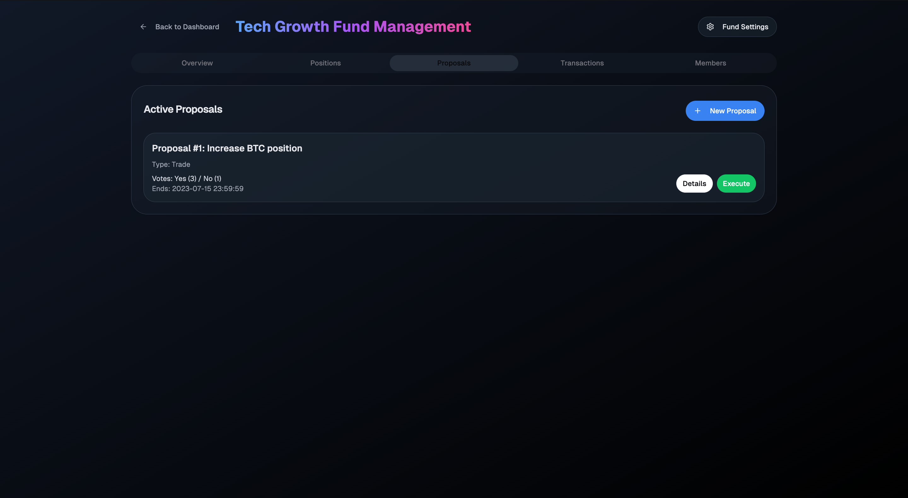

# Windfall


A decentralized fund management protocol built on Aptos. Windfall implements on-chain governance and asset management for collective investment vehicles, with a focus on transparency and programmatic execution.


Track fund performance, member allocations, and asset distribution in real-time.



Create and vote on investment proposals with detailed analytics.


Monitor asset positions and market performance across your portfolio.

## Quick Start

```bash
git clone https://github.com/saint0x/windfall.git
cd windfall
yarn install
yarn dev
```

## Stack

- Frontend: Next.js, TailwindCSS
- Backend: Rust, SQLite
- Blockchain: Aptos, Move

## License

Apache License 2.0
